# CCDB

[](https://github.com/Anivice/ccdb/actions/workflows/LinuxStaticBuildAction.yml)

> [!WARNING]
> ***CCDB HAS POOR CHINESE LANGUAGE SUPPORT***
>
> The translation is incomplete and existing translations are a mess.
> Texts lacking Chinese corresponding translations are shown in English.
> Missing texts will be shown in `~/.config/ccdb/MISSING-TRANSLATIONS.json`

> [!WARNING]
> ***CCDB DOES NOT SUPPORT 32BIT, BUT BINARIES ARE STILL PROVIDED***
> 
> As noted by HTTPLIB:
> > 32-bit platforms are **NOT supported**.
> > Use at your own risk.
> > The library may compile on 32-bit targets,
> > but no security review has been conducted for 32-bit environments.
> > Integer truncation and other 32-bit-specific issues may exist.
> > **Security reports that only affect 32-bit platforms will be closed without action.**
> > The maintainer does not have access to 32-bit environments for testing or fixing issues.
> > CI includes basic compile checks only,
> > not functional or security testing.

A lightweight terminal dashboard for Clash/Mihomo, written in C++.

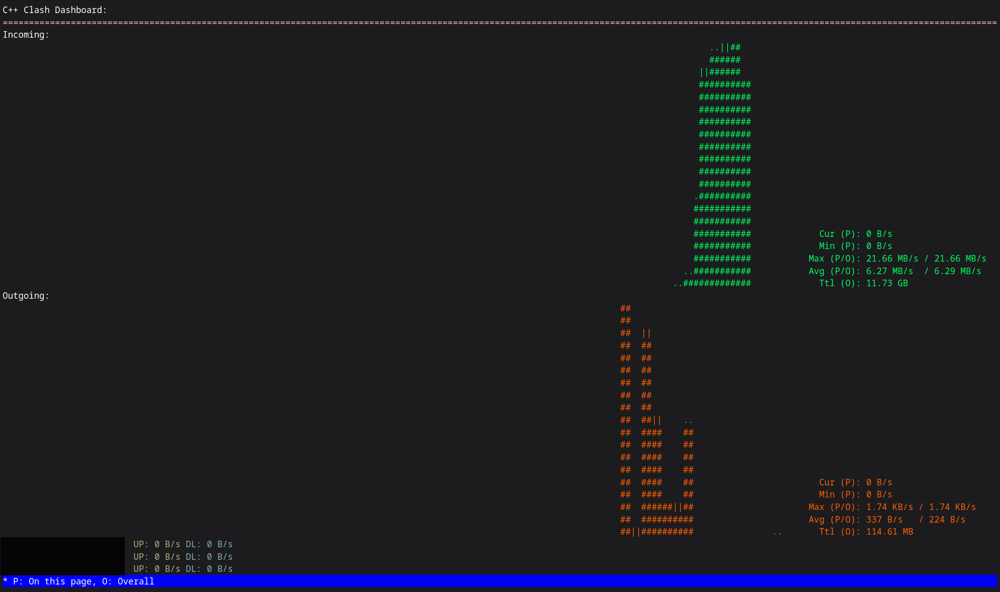

 - [Overview](#Overview)
 - [Features](#Features)
 - [Usage](#usage)
 - Quick Start Examples:
   * [Example 1: Switch Proxy in a Proxy Group](#example-1-switch-proxy-in-a-proxy-group)
   * [Example 2: Map the Entire Proxy Chain](#example-2-map-the-entire-proxy-chain)
   * [Example 3: Shell Parsing of `get config`](#Example-3-Shell-Parsing-of-get-config)
 - [How to Build](#how-to-build)

## Overview

CCDB targets low-resource environments (for example, embedded devices) and users who want a low-overhead dashboard.

CCDB depends on the following open-source libraries:
 - [CPP-HTTPLIB v0.48.0](https://github.com/yhirose/cpp-httplib) (Embedded)
 - [GNU Readline 8.3](https://ftp.gnu.org/gnu/readline/) (Embedded)
 - [GNU Ncurses 6.6](https://ftp.gnu.org/gnu/ncurses/) (Embedded)
 - [TSL Hopscotch-Hashing Map v2.4.0](https://github.com/Tessil/hopscotch-map) (Embedded)
 - [UTF8-CPP 4.1.1](https://github.com/nemtrif/utfcpp) (Embedded)
 - [JSON for Modern C++ 3.12.0](https://github.com/nlohmann/json) (Embedded)
 - [Perl 5.42.0](https://www.perl.org/) (Not embedded, required by OpenSSL)
 - [OpenSSL 3.6.2](https://github.com/openssl/openssl) (Embedded)
 - [GNU Tar 1.35](https://www.gnu.org/software/tar) (Embedded)
 - [XXD, from VIM](https://github.com/vim/vim/) (Not embedded, required by the build system)
 - zlib 1.3.2 (Embedded)
 - libpng 1.6.58 (Embedded)
 - [stb_image - v2.30 - public domain image loader](http://nothings.org/stb)
 - CImg 3.7.5 (Embedded)
 - libtiv - Copyright © 2017-2023, Stefan Haustein, Aaron Liu (Embedded)

## Features

### CCDB provides

 - Immediately close all connections
 - Watch currently active connections
 - nload-like traffic updates 
 - Switch the proxy mode (between "direct", "global", and "rule")
 - Watch Mihomo backend logs
 - Test latencies
 - Pull Subscription usage info (You have to specify the subscription link in `~/.ccdbrc`)
 - Unicode proxy name handling (experimental)
 - Switch proxies in a pure console using numeric indices
 - SSL Parsing for clash subscription links for metric usage info
 - Shell parsing of `ccdb` command output

> **Additional notes for numeric indices**:
> **The console needs to be able to actually show Unicode characters**,
> **otherwise** you might see placeholder glyphs, which makes the indices impossible to match to names.
> There are many ways to achieve this,
> but the simplest is using a bare-metal X display server like Xorg or XLibre paird with a terminal like Konsole.

## Usage

Use `help` command to see usage details.

Syntax:

```bash
ccdb [Arguments [OPTIONS...]...]
    -h,--help                Show help
    -v,--version             Show version
    -V,--version-license     Show version along with LICENSE
    -u,--url [ARG]           Backend url, usually http://localhost:9090
    -x,--execute [ARG]       Execute a CCDB command
    -t,--token [ARG]         Backend HTTP auth password
    -l,--latency_url [ARG]   Latency URL
    --subinfo                Get subinfo
    --subinfo_url [ARG]      Specify subscription URL (only for --subinfo)
    --report-issue           File a BUG report
    --no-fast-quit           No fast quit when Readline finishes
```

**Frequently Used Commands**:

```bash
...
get connections                 : Pull Active connections
closeConnections                : Close all connections
nload                           : nload-like connection speed monitoring
set mode [global, rule, direct] : Change proxy mode
set vgroup [VGROUP] [VPROXY]    : Change endpoints in a proxy group using index
mapProxyChain                   : Map out current proxy chain
...
```

**Environment**:

| Environment Variable                      | Descriptions                                                                                                                                                                                                                                                                                                                                                              |
|-------------------------------------------|---------------------------------------------------------------------------------------------------------------------------------------------------------------------------------------------------------------------------------------------------------------------------------------------------------------------------------------------------------------------------|
| `PAGER`                                   | Specify a pager. Pager availability check is ignored when this environmental variable is set                                                                                                                                                                                                                                                                              |
| `NOPAGER`                                 | Set this to 'y' and force ccdb to ignore pager                                                                                                                                                                                                                                                                                                                            |
| `COLOR`                                   | Set it to `never` to disable color codes                                                                                                                                                                                                                                                                                                                                  |
| `JQ`                                      | Set JSON parser, default is `jq`, if available                                                                                                                                                                                                                                                                                                                            |
| `TABSIZE`                                 | Set tab size when printing tables, default is 4                                                                                                                                                                                                                                                                                                                           |
| `REVERSE_MOUSE`                           | Reverse mouse scrolling direction when set to `true`                                                                                                                                                                                                                                                                                                                      |
| `NO_0xFE0F_EXPAND_EMOJI`                  | Fix Unicode processing issues for emoji space expand code, e.g., "✈" and "✈️". If you cannot notice any differences of the above emojis, or there's wierd Unicode processing bugs in your terminal, you might want to set this to `true`.                                                                                                                                 |
| `DISABLE_SERVER_CERTIFICATE_VERIFICATION` | TLS is enabled by default when URLs use HTTPS. Set this to `true` to skip server SSL certificate check (insecure).                                                                                                                                                                                                                                                        |
| `SSL_CERTIFICATE`                         | When URLs are https, specify an SSL certificate location.                                                                                                                                                                                                                                                                                                                 |
| `NOCOREDUMPCHECK`                         | Disable CCDB crash info gathering on start up                                                                                                                                                                                                                                                                                                                             |
| `NO_HIGHLIGHTER_LINE_COLOR_CODE`          | Even when setting `COLOR` to `n`, highlight line still has color codes to retain its basic function in `get connections`. `COLOR=n` is essentially a way to turn terminal into monocolor. If you want to disable color codes completely, including highlight lines, set `NO_HIGHLIGHTER_LINE_COLOR_CODE` to `true`. Note that this will make highlighted lines invisible. |

**Keyboard Shortcuts**:

  - `get connections`: Get connections has multiple keyboard shortcuts:
      * Mouse Click/Ctrl+UP/DOWN: Move highlight
      * K: Kill the highlighted connection
      * P: Print raw JSON from Mihomo core. If `jq` can be found, JSON will be parsed by jq
      * F1-F12: Specify which column (0-11) to sort the table, press on the same column again to reverse the sort
      * Ctrl+C: Abort the watcher
      * /: Search and highlight

Press Tab twice to list candidates in a command,
this will list all the available candidates like proxy endpoints or groups,
with additional information like latency (if tested) and vector index.

To run a shell command, prefix it with `"$ "` (dollar sign + space/`$[WITH A SPACE]`).

> **NOTE 1:**
> 
> Double tab will show the helper details of each and every candidate:
> 
> 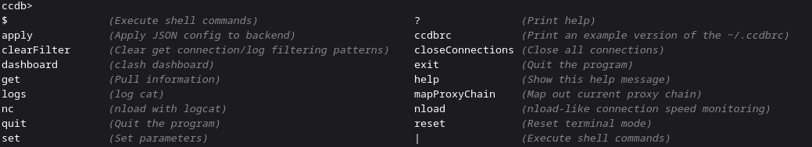
> 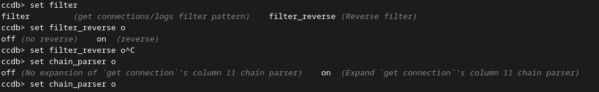

> **NOTE 2:**
> 
> https://github.com/Anivice/ccdb/blob/c5b70b0a5202ae794469e36ee95c3f00c646facf/ccdbrc.example#L56-L57
> 
> Comments for the aliases will be noted and printed in the double tab helper as well:
> 
> e.g.:
> 
> ~/.ccdbrc definition: 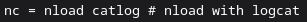
> 
> Helper output: 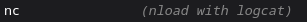


### Example 1: Switch Proxy in a Proxy Group

#### Step 1

Select the group you want to switch by the following command:

```bash
set vgroup [DOUBLE TAB TO LIST GROUPS YOU WANT TO SWITCH]
```

You should see the vector results similar to this image (groups and endpoints are redacted):

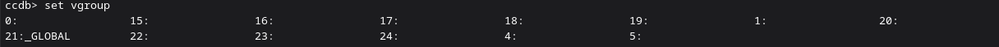

#### Step 2

Say, I want to change group `44`.
Use the following command to list the proxy I can set for this group:

```bash
set vgroup 44 [DOUBLE TAB TO LIST WHICH PROXY ENDPOINT YOU WANT TO SWITCH TO]
```

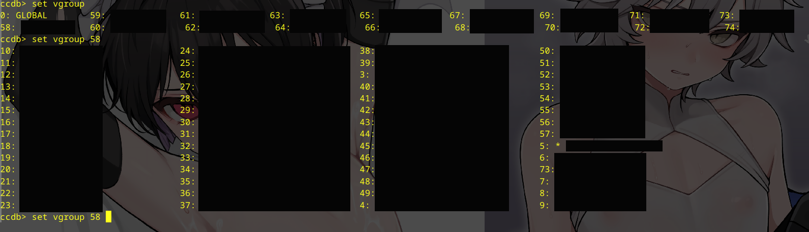

> As is shown in the above image, currently selected proxy is marked with a prefix " * "
> and is highlighted in the candidate selection prompt.
> The selected endpoint for the above proxy group `44` is `3`.

#### Additional Note

If you tested latency before using `get latency`,
the latency results will be shown in the parentheses, i.e., `([\d]+)`,
as is shown in the following image.

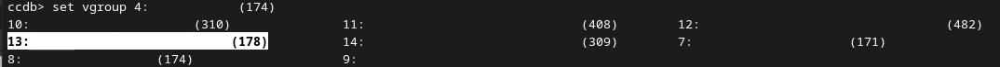

### Example 2: Map the Entire Proxy Chain

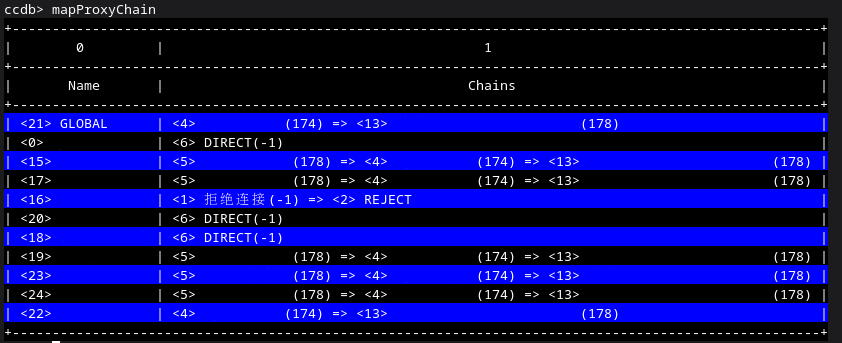

### Example 3: Shell Parsing of `get config`

CCDB supports shell parsing of its own command outputs.
Unlike shells, "|" has to be surrounded by spaces, i.e., ` | ` (`[SPACE]|[SPACE]`).
This can be useful for commands like `get config` to parse JSON on external utilities like `jq`.
For example, you can select `dns-hijack` from the JSON reply from backend using 
`get config | jq -r '.tun["dns-hijack"]'`:

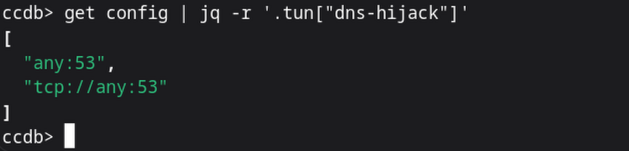

Or, you can even pipe a POSIX script into the pipeline:

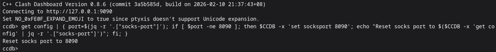

As you can see, when executing a piped script, you can invoke `ccdb` with
environment variable `$CCDB`, which is a duplicate of the parent `ccdb` arguments.

## How to Build

### Linux

#### Requirements

You need

  * a complete C++ toolchain of either GCC or Clang that can process at least C++ 17 (GCC >= 13 would be fine)
  * `cmake` and your build system of choice (either Unix Makefile [`make`] or Ninja [`ninja`]).
  * `tar`, `sed`, and `grep`, the standard POSIX tools that should exist on all Linux systems by default.
  * GNU's `automake`, required by `tar` package for `ccdb`

to build CCDB.

All dependencies are embedded inside the source code. No additional installation required.

#### CMake Settings
  * `OPENSSL_TARGET`: Supported openssl target, if you are cross-compiling you need to specify a platform.
  * `OPENSSL_LIBP`: Depending on the target, openssl can have its lib in `.../lib` or `.../lib64`, you can tell CMake this info by setting it to `lib` or `lib64`.

#### Build

On x86_64, you can use the command

```bash
  git clone https://github.com/Anivice/ccdb --depth=1 && \
  cd ccdb && mkdir build && cd build && \
  cmake ../src/ -DPERL_MAKE_ADDITIONAL_FLAGS=-j$(nproc) -DOPENSSL_MAKE_ADDITIONAL_FLAGS=-j$(nproc) -DREADLINE_MAKE_ADDITIONAL_FLAGS=-j$(nproc) -DNCURSES_MAKE_ADDITIONAL_FLAGS=-j$(nproc) \
      -DCC_ADDITIONAL_OPTIONS="-O3 -fomit-frame-pointer -ffast-math -fstrict-aliasing -fdata-sections -ffunction-sections -D_FORTIFY_SOURCE=2 -fno-stack-protector -s" \
      -DLD_ADDITIONAL_OPTIONS="-O3 -fomit-frame-pointer -ffast-math -fstrict-aliasing -fdata-sections -ffunction-sections -D_FORTIFY_SOURCE=2 -fno-stack-protector -s" \
      -DOPENSSL_TARGET=linux-x86_64 -DOPENSSL_LIBP=lib64 && \
  make -j$(nproc)
```

to build locally.

## Disclaimer

**This is free software; 
There is *NO* warranty;
not even for MERCHANTABILITY or FITNESS FOR A PARTICULAR PURPOSE.
This project is provided "as is." DO NOT use it in production.**

**YOU HAVE BEEN WARNED**

**CCDB is GPLv3-licensed to comply with its statically linked GPL dependencies.**

See `LICENSE` for details.
